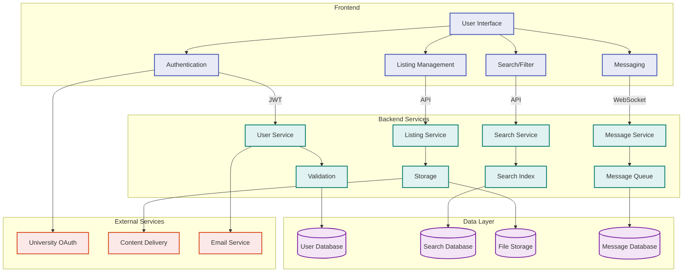

```mermaid
graph TB
    subgraph "Frontend"
        UI[User Interface] --> Auth[Authentication]
        UI --> Search[Search/Filter]
        UI --> List[Listing Management]
        UI --> Msg[Messaging]
    end

    subgraph "Backend Services"
        Auth --> |JWT| UserS[User Service]
        Search --> |API| SearchS[Search Service]
        List --> |API| ListS[Listing Service]
        Msg --> |WebSocket| MsgS[Message Service]
        
        UserS --> Valid[Validation]
        SearchS --> Index[Search Index]
        ListS --> Store[Storage]
        MsgS --> Queue[Message Queue]
    end

    subgraph "Data Layer"
        Valid --> UserDB[(User Database)]
        Index --> SearchDB[(Search Database)]
        Store --> FileDB[(File Storage)]
        Queue --> MsgDB[(Message Database)]
    end

    subgraph "External Services"
        Auth --> OAuth[University OAuth]
        Store --> CDN[Content Delivery]
        UserS --> Email[Email Service]
    end

    classDef frontend fill:#e8eaf6,stroke:#3f51b5,stroke-width:2px;
    classDef backend fill:#e0f2f1,stroke:#00796b,stroke-width:2px;
    classDef database fill:#f3e5f5,stroke:#7b1fa2,stroke-width:2px;
    classDef external fill:#fbe9e7,stroke:#d84315,stroke-width:2px;
    
    class UI,Auth,Search,List,Msg frontend;
    class UserS,SearchS,ListS,MsgS,Valid,Index,Store,Queue backend;
    class UserDB,SearchDB,FileDB,MsgDB database;
    class OAuth,CDN,Email external;
```